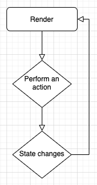
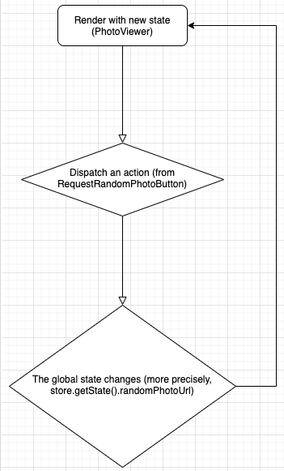

# ui-theory

## Rationale
This repo contains no dependencies at all except `parcel` and `gh-pages` which are only used for development purposes.

I tried to mimic some general syntax or structure of React (but tbh I did not look at React's source code, but it might be far away from how React works)
But it's working, and I think that this is a good example to demonstrate how UI should work.

The this repository effectively explains how:
- to append and assemble dom elements together (a bit like `Component#render` or `ReactDOM.render`, despite HUGE difference in fact)
- make some dead simple alternative of `styled-component`
- hooks like `useEffect` and `useState` work
- global state works
- an UI component works and the fact that it is only a function (UI = f(state))
- closure works to make all of things above happen

FYI, I was too bothered to use typescript. Sorry. But it really shows that you can still make this far without typescript.
Plus, I think it would be better for beginners to look at js rather than ts (but still I believe ts is 10000 times better than js)

## Explanation

So let's go through one by one.

### ui/renderDOM.js
This is just a `function` that can receive an input like 

```js
[
  document.createElement('main'),
  [
    document.createElement('section'),
    [
      document.createElement('article'),
      document.createElement('p'),
    ],
  ],
  document.createElement('article')
  [
    document.createElement('section'),
    [
      document.createElement('img'),
      document.createElement('h2'),
    ]
  ],
]
```

and then turn it into a DOM tree like

```html
<div id="root">
  <main>
    <section>
      <article></article>
      <p></p>
    </section>
  </main>
  <article>
    <section>
      
      <h2></h2>
    </section>
  </article>
</div>
```

We use array because we would have to write another transplier like babel if we wanted to use jsx.

This implies another thing: you can actually assemble HTML elements into a small tree first inside the component, like this:

```js
const PhotoContainer = styled`figure``
  border: 1px solid black;
  min-width: 500px;
  min-height: 500px;
`

const Photo = styled`img```

export default (store) => {
  const render = () => {
    const randomPhotoUrl = store.getState().randomPhotoUrl;

    useEffect(() => {
      if (randomPhotoUrl) {
        Photo.src = randomPhotoUrl;
      }
    }, [randomPhotoUrl])

    Photo.setAttribute('loading', 'lazy');

    return renderDOM([
      Photo,
    ], PhotoContainer);
  }

  return render;
};
```

You can actually write `renderDOM` inside a component as well. 

```js
return renderDOM([
  Photo,
], PhotoContainer);
```

This code above will give you

```html
<figure>
  
</figure>
```

And it can again be fed into `renderDOM` at the root level again!

## ui/styled.js

This is a really just a simple alternative to styled-component.
It would just randomly generate one `className` for a HTML element and apply the given styles to that element. 

Lots of more things can be done to this file, but it just works now. It's just the bare minimum that I just wanted to create.

## hooks/useState.js

This is the useState function. It will receive `renderCount` and `setRenderCount` as parameters.
It will simply give you two things: `[valueInClosure, setter]`. Just basically same as React. One difference is you access the value via `valueInClosure.value`.

## hooks/useEffect.js

Just the same as React here as well.
Every single time `useEffect` is called, it is going to check if any of the dependencies have changed. If yes, it is going to run the callback and update the dependencies accordingly.

## hooks/index.js

Just where `useState` and `useEffect` get assembled together. 

Lots of things can be improved here as well. And most importantly using multiple useEffect and useState in one component would not be possible yet, judging from the code that I wrote (haven't tried yet, though).

## global-state/store.js

You will keep all necessary in the closure, and return them to use them outside of the function.

Basically it provides same things as redux does: `subscribe`, `getState`, `dispatch`.

## global-state/reducer.js

Reducer receives a previous state and an action. It is triggered when some action is dispatched.

it will return newly updated state due to the action.

## global-state/actionTypes.js

Just a definition of actionTypes. Remember, in pure javascript, there is still a way to make something like an `enum` in typescript: `Object.freeze`. Use it.

```js
export const actionTypes = Object.freeze({
  UPDATE_RANDOM_PHOTO_URL: 'UPDATE_RANDOM_PHOTO_URL',  
});
```

## global-state/actions.js

An action is purely just a function that receives a payload and returns it along with its `type`, like this:

```js
import { actionTypes } from './actionTypes.js';

export const updateRandomPhoto = (randomPhotoUrl) => ({
  type: actionTypes.UPDATE_RANDOM_PHOTO_URL,
  randomPhotoUrl,
});

```

We are going to use this action when we receive information of the random photo inside the component.

## components/RequestRandomPhotoButton.js

```js
const RequestRandomPhotoButton = (store) => {
  const render = () => {
    const [isLoading, setIsLoading] = useState(false, render);

    useEffect(() => {
      if (isLoading.value) Button.textContent = 'loading'
      else Button.textContent = 'click the button to request random image'
    }, [isLoading.value]);

    const handleButtonClick = async () => {
      setIsLoading(true);
      const { data, error } = await fetchSingleRandomPhoto();
      if (error) console.error(error);
      store.dispatch(updateRandomPhoto(data.url));
      setIsLoading(false);
    }

    Button.onclick = handleButtonClick;

    return Button;
  }

  return render;
}

export default RequestRandomPhotoButton;
```

Pretty much similar to a functional component in React, right?

It really... just works as you expected. But if we get bothered to make it into a simple flowchart:

```js
UI = f(isLoading)
```

And then, there is `useEffect`. As its name suggests, it performs some side effect. And when you say side effect, it's just basically anything else that a `render` function does other than `return Button`. If you wanna dig more into why it's named like that, maybe it's a good chance to look into what a pure function is.

I kept wondering if there is any other way than explicitly calling `render` after some state has changed, but unfortunately I found no such solution for now. That's the reason I put it this way:

```js
const [isLoading, setIsLoading] = useState(false, render);
```

And inside `useState`, it is going to call `render` on calling the setter function.

So if you really inspect how `RequestRandomPhotoButton` works, 



It's that simple.

So what's an action here then? Although not explicitly written, the action would be **"clicking the button"**. Then the state would change `setIsLoading(true)`. That's already one full cycle of the flowchart, because the UI then would have already changed according to

```js
if (isLoading.value) Button.textContent = 'loading'
```

Then you will request random photo and again you will set loading as false. Then you will do another full cycle of the flowchart.

Then what's `store.dispatch`? It dispatches the action called `updateRandomPhoto`, and it is going to update the global state of the application. Why is the global state needed? Because there are multiple components in your application and you cannot just live your life only with `useState`. You need something more convenient to share the state across multiple components.

Once you dispatch `updateRandomPhoto`, you will have to look at `PhotoViewer.js`:

## components/PhotoViewer.js

```js
export default (store) => {
  const render = () => {
    const randomPhotoUrl = store.getState().randomPhotoUrl;

    useEffect(() => {
      if (randomPhotoUrl) {
        Photo.src = randomPhotoUrl;
      }
    }, [randomPhotoUrl])

    Photo.setAttribute('loading', 'lazy');

    return renderDOM([
      Photo,
    ], PhotoContainer);
  }

  return render;
};
```

Again, it is going to show a different photo if `randomPhotoUrl` changes.

But remember, the action started from a different component. So if you explain it in a flowchart:



So... every time you dispatch `updateRandomPhoto`, PhotoViewer will essentially show you a different picture (which is the first rectangle in the flowchart)

## components/Layout.js

We don't have a lot to talk here, but a good observation would let you know it's a pure function.

## api/**/*

This is just an util.

## Summary

Overall, the implementation still lacks a reconciliation and virtual DOM. But this repository serves an enough purpose to show what an UI is.